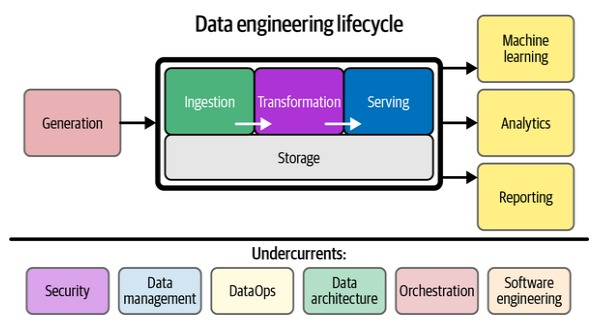

# Data Engineering 101

The goal of this project is to demonstrate the fundamentals of data engineering. Although todays data engineers typically work within the cloud this project is designed to work 100% locally.

This project is heavily influenced on the teachings of the O'Reilly book [Fundamentals of Data Engineering](https://www.oreilly.com/library/view/fundamentals-of-data/9781098108298/) by Joe Reis, Matt Housley.

## Data Engineering Life



[Generation](project/generation/README.md) -> [Storage](project/storage/README.md) -> [Serve](project/serve/README.md)

### Project Outline
```bash
./project
├── generation
│   ├── app
│   └── README.md
├── serve
│   ├── analytics
│   │   └── README.md
│   ├── datascience
│   │   └── README.md
│   ├── README.md
│   └── reverse_etl
│       └── README.md
└── storage
    ├── elt
    │   └── README.md
    ├── README.md
    ├── reverse_etl
    │   └── README.md
    └── warehouse
        ├── app
        ├── database
        └── README.md
```

