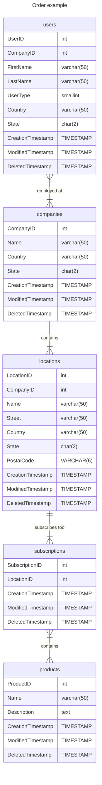

```mermaid
---
title: Order example
---
erDiagram
    users }|--|{ companies : "employed at"
    users {
        UserID int
        CompanyID int
        FirstName varchar(50)
        LastName varchar(50)
        UserType smallint
        Country varchar(50)
        State char(2)
        CreationTimestamp TIMESTAMP
        ModifiedTimestamp TIMESTAMP
        DeletedTimestamp TIMESTAMP
    }
    companies ||--|{ locations : contains
    companies {
        CompanyID int
        Name varchar(50)
        Country varchar(50)
        State char(2)
        CreationTimestamp TIMESTAMP
        ModifiedTimestamp TIMESTAMP
        DeletedTimestamp TIMESTAMP
    }
    locations ||--|{ subscriptions : "subscribes too"
    locations {
        LocationID int
        CompanyID int
        Name varchar(50)
        Street varchar(50)
        Country varchar(50)
        State char(2)
        PostalCode VARCHAR(6)
        CreationTimestamp TIMESTAMP
        ModifiedTimestamp TIMESTAMP
        DeletedTimestamp TIMESTAMP
    }
    subscriptions }|--|{ products : contains
    subscriptions {
        SubscriptionID int
        LocationID int
        CreationTimestamp TIMESTAMP
        ModifiedTimestamp TIMESTAMP
        DeletedTimestamp TIMESTAMP
    }
    products {
        ProductID int
        Name varchar(50)
        Description text
        CreationTimestamp TIMESTAMP
        ModifiedTimestamp TIMESTAMP
        DeletedTimestamp TIMESTAMP
    }

```
